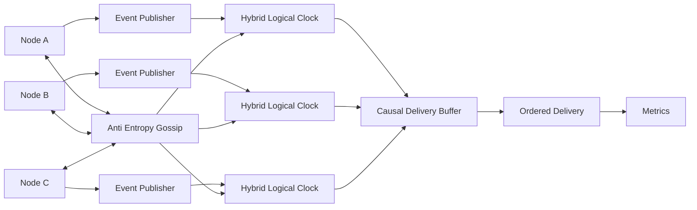

# Global Causal Ordering Without Centralized Coordination

Inspired by concepts used in Cloudflare Durable Objects, Discord Messaging Infrastructure and CockroachDB's Hybrid Logical Clocks.

## Problem

In globally distributed systems, events generated in different regions must preserve causal ordering.

If:

A → B

then every node should observe A before B.

The challenge is that:

* No global clock exists
* Network partitions occur
* Physical clocks drift
* Nodes may restart

Traditional vector clocks become expensive at scale because metadata grows O(n).

This project demonstrates a lightweight causal ordering engine using Hybrid Logical Clocks (HLC) and causal delivery buffering.

---

## Concepts Implemented

### Hybrid Logical Clocks

Every event carries:

```ts
{
  physicalTime: number;
  logicalCounter: number;
  nodeId: string;
}
```

Hybrid Logical Clocks combine:

* Physical Time
* Logical Time

to preserve causality while remaining compact.

---

### Event Publisher

Every outgoing event receives an HLC timestamp.

Example:

```txt
Node-A

Message:
CreateUser

HLC:
(1718700000, 2, A)
```

---

### Causal Delivery Buffer

Incoming messages are not delivered immediately.

Messages are buffered until:

```txt
All causal predecessors have arrived
```

This prevents causal violations during network delays.

---

### Anti-Entropy Gossip

Nodes periodically exchange clock information.

Purpose:

* Reduce clock skew
* Synchronize HLC state
* Recover after partitions

---

### Network Partition Simulation

The simulator intentionally disconnects nodes.

Example:

```txt
Node-A  X  Node-B
```

Events evolve independently.

After reconnection:

```txt
Node-A  <--> Node-B
```

The engine merges histories while preserving causal order.

---

## Metrics

### hlc_drift_ms

Difference between physical time and HLC time.

### causal_gap_count

Number of missing predecessors.

### out_of_order_delivery_rate

Messages arriving before dependencies.

### clock_sync_failures

Failed gossip synchronizations.

---

## Failure Modes Simulated

### NTP Jump Backward

Clock regression causes timestamp anomalies.

### Node Restart

Loss of in-memory HLC state.

### Network Partition

Independent causal histories.

### Excessive Clock Skew

Messages rejected as too old.

---

## Running

```bash
npm install
npm run dev
```

---

## Example Flow

```txt
Node A
   │
   │ Event E1
   ▼

Node B receives E1

Partition Occurs

Node A -> E2
Node B -> E3

Partition Heals

Anti Entropy Gossip

Causal Buffer Validation

Correct Delivery Order Restored
```

---

## Architecture


