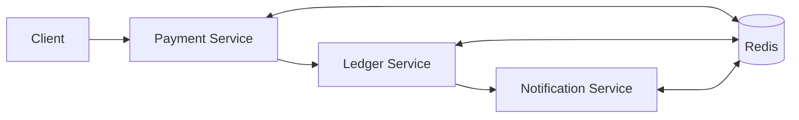
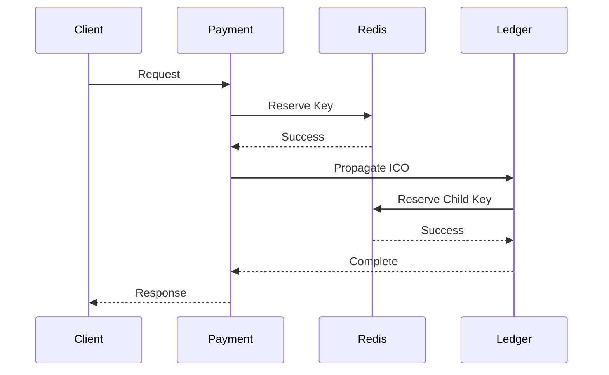

# Distributed Idempotency Propagator

A distributed systems project that demonstrates cross-service idempotency propagation across a payment workflow.

Instead of treating idempotency as an API-layer concern, this project propagates idempotency context across multiple services to prevent duplicate side effects during retries.

## Problem

Consider the following workflow:

```text
Client
  ↓
Payment Service
  ↓
Ledger Service
  ↓
Notification Service
```

A retry can occur at any layer due to:

* Gateway timeouts
* Network failures
* Service crashes
* Client retries

Without distributed idempotency:

* Payments may be charged twice
* Ledger entries may be duplicated
* Notifications may be sent multiple times

The goal is to ensure retries never create additional side effects.

---

## Architecture



Redis stores idempotency records and cached responses.

Each service derives its own child key while preserving lineage to the original request.

---

## Core Idea

### Idempotency Context Object (ICO)

```json
{
  "parentKey": "payment_123",
  "childKey": "ledger_abc",
  "serviceId": "ledger-service",
  "operationType": "write-ledger"
}
```

### Child Key Derivation

```text
childKey =
HMAC(parentKey, serviceId + operationType)
```

### Atomic Reservation

```text
SET key PROCESSING NX
```

* Success → execute request
* Failure → return cached response

This guarantees at-most-once execution.

---

## Request Flow



---

## Project Structure

```text
src/
├── api/
├── config/
├── grpc/
├── idempotency/
├── observability/
├── saga/
├── services/
├── shared/
└── index.ts

tests/
scripts/
docs/
proto/
```

---

## Running Locally

### Install

```bash
npm install
```

### Start Redis

```bash
docker compose up redis
```

### Run Application

```bash
npm run dev
```

### Run Tests

```bash
npm run test
```

---

## Failure Cases Handled

### Duplicate Retries

A request is executed only once and future retries receive the cached response.

### Service Crash After Commit

Completed operations are detected and replayed safely.

### Retry Storms

Concurrent retries share the same idempotency record.

### Missing Context Propagation

Invalid or missing ICO metadata is rejected by interceptors.

---

## Future Improvements

* PostgreSQL persistence
* Redis Lua scripts
* OpenTelemetry tracing
* Kafka integration
* Fencing tokens
* Multi-region support
* Saga compensation workflows

---

## Key Takeaway

Idempotency is not a single-service feature.

In distributed systems, it becomes a contract that must be propagated, validated, and enforced across every service involved in a workflow.
